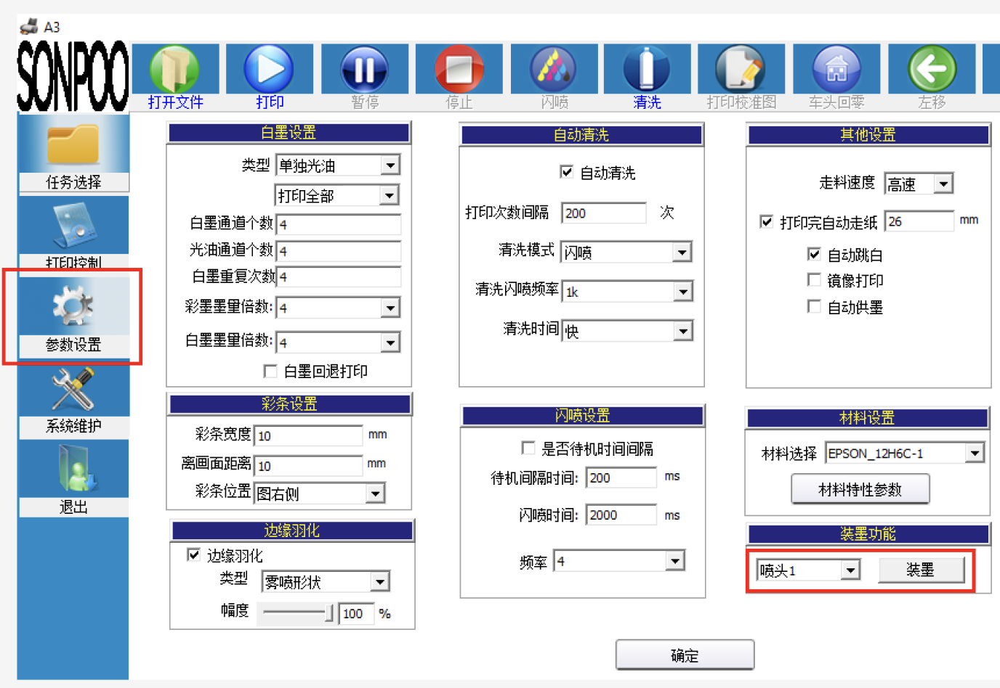
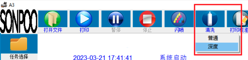
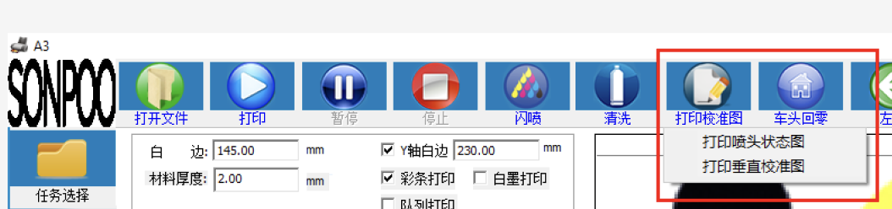
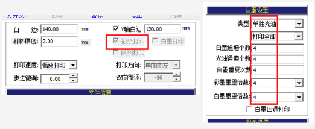
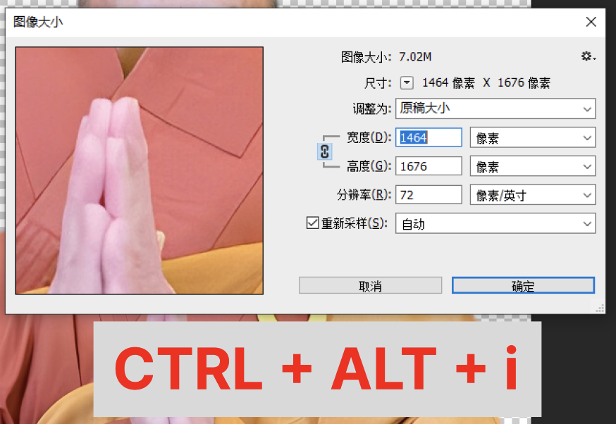
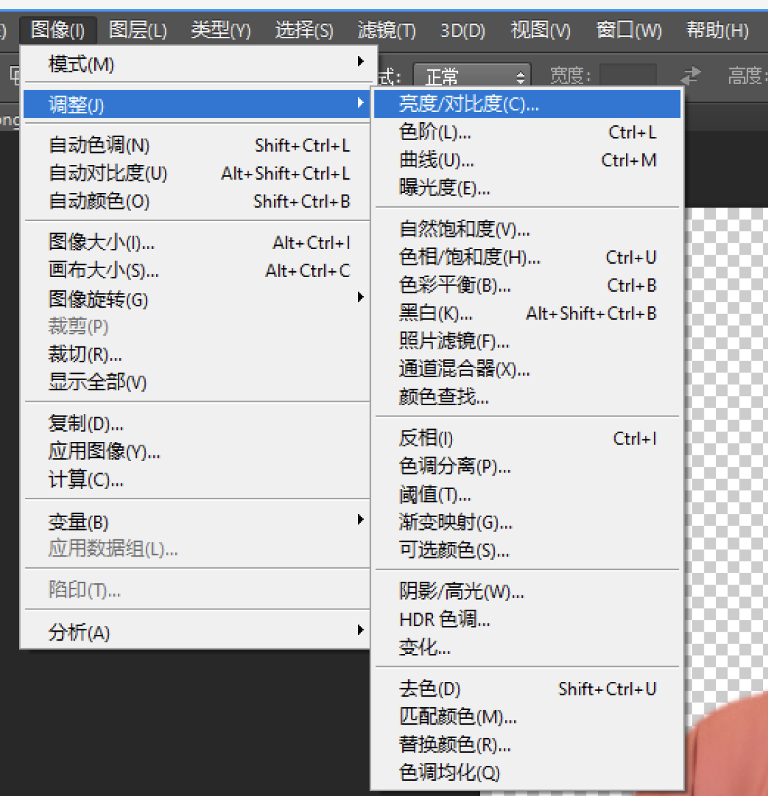
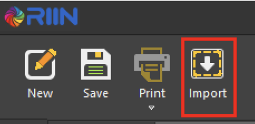
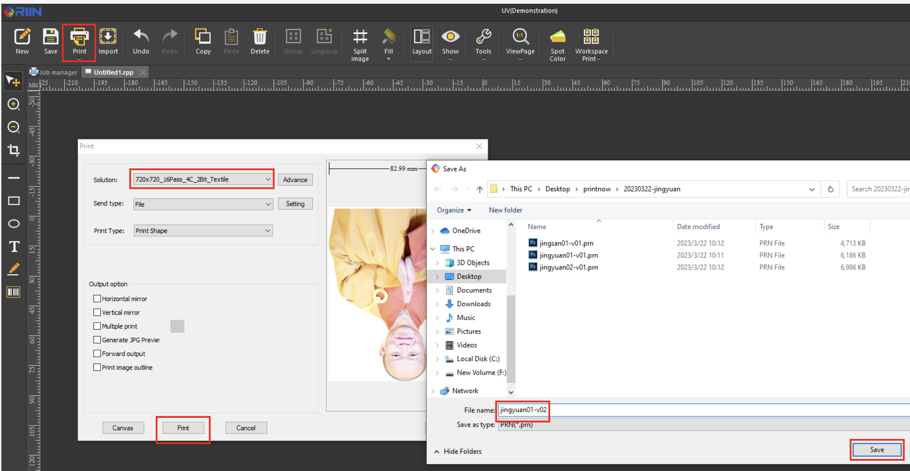
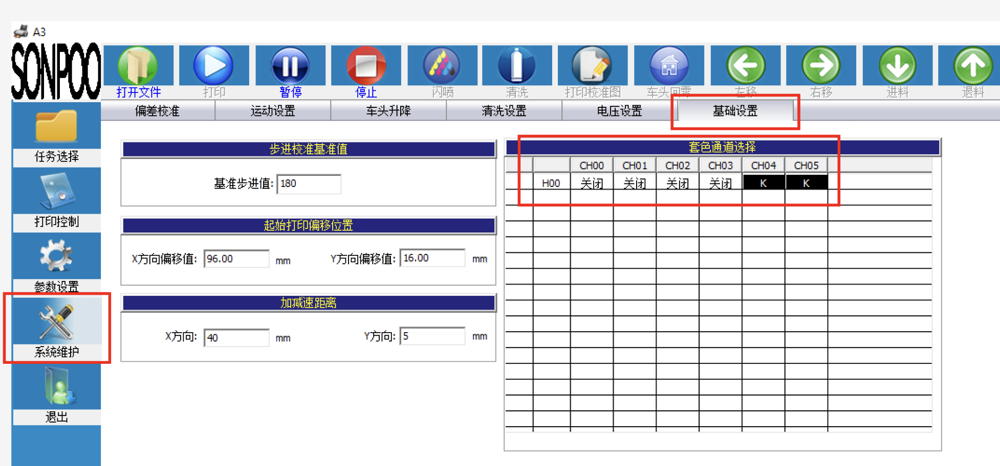
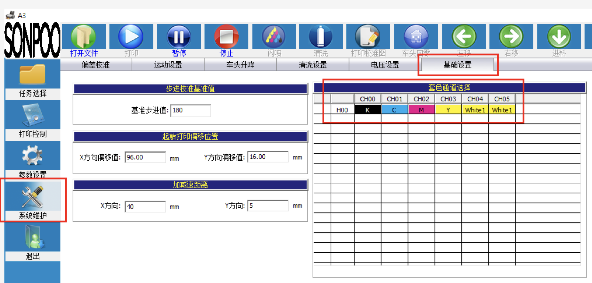

# UV Printing

Step by Step

## Daily Checklist

1. 参数设置 -> 喷头 1 [装墨]
   

2. 清洗 [深度清洗]
   

3. 使用棉花棒擦干净 print 头，ink pump

4. 打印标准图
   
5. Print 打开文件 -> abestcolor-test-cmyk
   - ✓ 彩条打印 | 单独油光 | 打印全部
   - 8 8 8 8 8 / 4 4 4 4 4
     

6. Check printed color

## Image Edit

1. Tools unblur / remove bg of image
   - https://picwish.com/unblur-image-portrait
   - https://www.remove.bg/

2. Photoshop
   - Width / Height at least need 1000px
   

   - Brightness + 30 to 40%
   

   - <b>** Must save in jpg format **</b>

3. RIIN
   - Print canva: 16Pass 4C 2bit textile
   - Safe size: 100×100mm (Standard leaf size)
   - Import jpg
   

   - Save in .prn format and ready to print
   

## Print on Leaf

1. Print 白底 (... -black.jpg)
   - x6 repeat
   - 系统维护 -> 基础设置 
    Close all colors, open white only: | 关闭 | 关闭 | 关闭 | 关闭 | K | K |
   
   - 8 8 8 8 8 / 4 4 4 4 4

2. Print image
   - x1
   - 系统维护 -> 基础设置
   - | K | C | M | Y | White1 | White1 |
   
   - 4 4 4 4 4

## System User Manual

- https://www.rainbow-inkjet.com/uploads/Manual-Book-of-Wellprint-Control-Software.pdf

